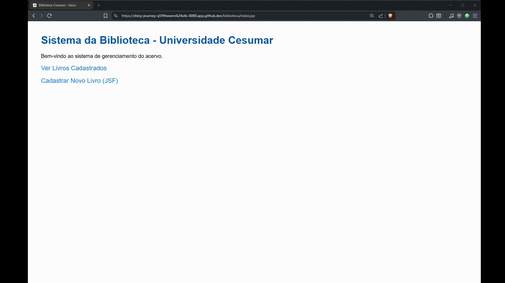

# 📚 Biblioteca Web - Sistema de Gerenciamento

[](https://github.com/aluiziolira/fab_soft_biblioteca/actions/workflows/ci-build-test.yml)
[](https://codecov.io/gh/aluiziolira/fab_soft_biblioteca)

  

---

## 📖 Visão Geral

Este projeto é um sistema de gerenciamento de biblioteca desenvolvido como uma aplicação web usando Java e o framework Jakarta Server Faces (JSF). O objetivo é criar um CRUD (Create, Read, Update, Delete) funcional para gerenciar livros, demonstrando práticas de desenvolvimento com Java para a web, arquitetura em camadas (MVC) e automação de build com Maven.

É um projeto de portfólio focado em demonstrar competências essenciais no ecossistema Java corporativo.



---

## ✨ Funcionalidades

- **Cadastro de Livros:** Adicionar novos livros ao acervo.
- **Listagem de Livros:** Visualizar todos os livros cadastrados.
- **Edição de Livros:** Atualizar informações de um livro existente.
- **Exclusão de Livros:** Remover livros do acervo.

---

## 🛠️ Stack & Tecnologias

- **Backend:** Java 17, Jakarta Server Faces (JSF), Contexts and Dependency Injection (CDI)
- **Build & Dependências:** Apache Maven
- **Testes:** JUnit 5
- **Servidor de Aplicação:** Compatível com Tomcat, WildFly, etc.

---

## 🚀 Setup Local

Siga os passos abaixo para executar o projeto localmente.

**Pré-requisitos:**
- JDK 17 ou superior
- Apache Maven 3.8+
- Um servidor de aplicação como o Apache Tomcat 9+

**Passos:**

1. **Clone o repositório:**
   ```bash
   git clone https://github.com/<aluiziolira>/fab_soft_biblioteca.git
   cd fab_soft_biblioteca
   ```

2. **Compile e empacote o projeto:**
   ```bash
   mvn clean package
   ```
   Isso irá gerar o arquivo `biblioteca.war` no diretório `target/`.

3. **Faça o deploy no servidor:**
   Copie o arquivo `biblioteca.war` para a pasta `webapps` do seu servidor de aplicação (ex: `apache-tomcat-9.0.80/webapps/`).

4. **Acesse a aplicação:**
   Inicie seu servidor e acesse `http://localhost:8080/biblioteca` (ou a URL correspondente).

---

## ⚙️ Pipeline CI/CD

O pipeline de Integração Contínua (CI) no GitHub Actions é acionado a cada `push` ou `pull request`. Ele garante a qualidade do código ao executar:

1.  **Build & Test:** Compilação do projeto e execução de todos os testes unitários com o Maven.

---

## 🤝 Como Contribuir

Contribuições são bem-vindas! Se você tem sugestões para melhorar o projeto, sinta-se à vontade para abrir uma **Issue** ou enviar um **Pull Request**.
